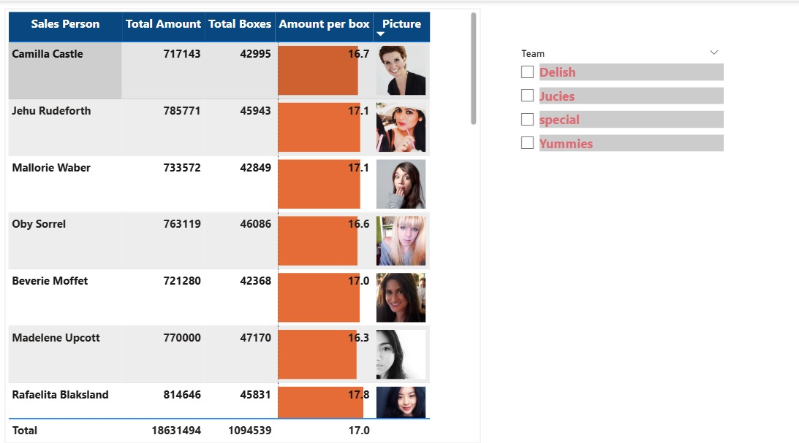

# 📊 Enterprise Chocolate Sales Performance Dashboard
A high-impact, interactive Power BI executive dashboard transforming raw corporate transactional records into a stylized financial reporting system.
## 📸 Dashboard Preview

##  Data Engineering & UI/UX Features
Advanced Power Query Cleaning: Handled missing data variables, resolved row anomalies, and cleaned structural space gaps to ensure accurate reporting metrics.
Dynamic DAX Architecture: Engineered robust calculated measures utilizing Data Analysis Expressions (DAX) for secure division logic and custom KPIs.
Executive UI/UX Optimization: Structured a clean visual hierarchy using rule-based conditional formatting (data bars) and interactive team filter slicers to maximize data scannability for stakeholders.
Row-Level Visual Assets: Integrated dynamic profile indicators to bind performance metrics directly to individual sales representatives.

